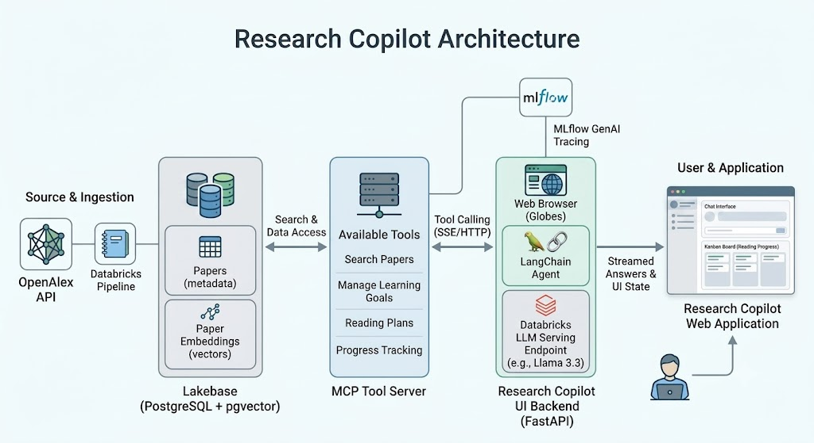
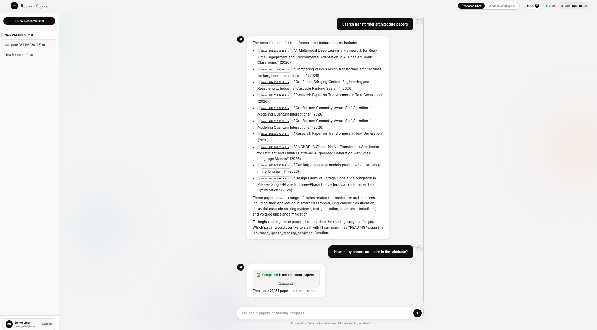
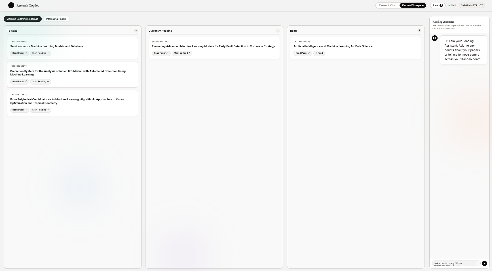
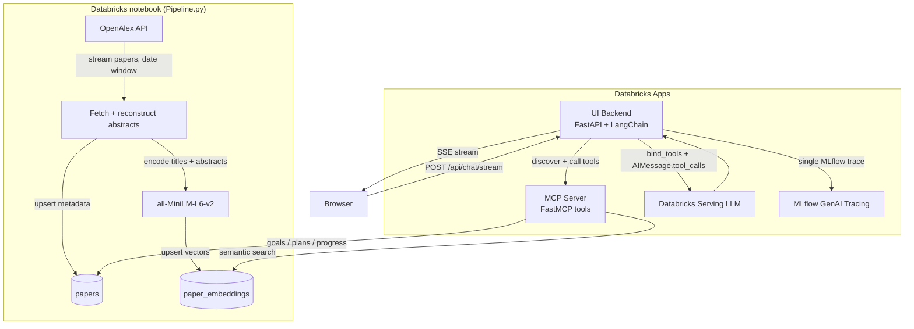
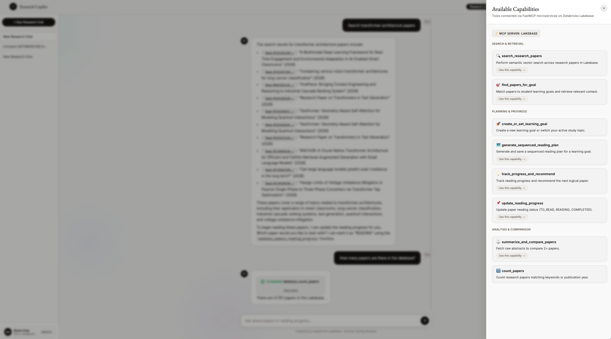
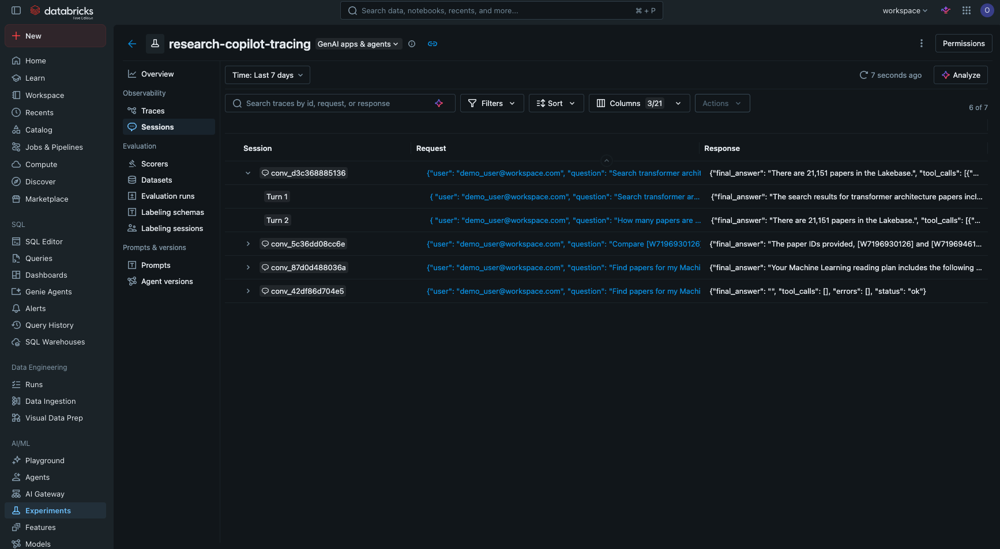

# Research Copilot

A research assistant that searches academic papers, builds sequenced reading plans, and tracks your reading progress — all from a chat interface. It is powered by Databricks Lakebase (PostgreSQL + pgvector), OpenAlex, an LLM serving endpoint, and MLflow GenAI tracing.

Ask questions in natural language; an LLM agent calls MCP tools to search papers, create learning goals, generate reading plans, and move papers across a Kanban board (To Read → Currently Reading → Read). Every run is captured as a single MLflow trace you can inspect or share.



---

## Features

- **Semantic paper search** — vector-similarity search over paper titles + abstracts using `all-MiniLM-L6-v2` embeddings stored in pgvector.
- **Automated ingestion** — a Databricks notebook pulls papers from the [OpenAlex](https://openalex.org) API, upserts them into Lakebase, and computes embeddings.
- **Learning goals** — create or switch an active goal; the agent tailors searches, plans, and recommendations to it.
- **Sequenced reading plans** — generate a reading plan of 3–5 papers for a goal and save it to Lakebase.
- **Kanban progress tracking** — the board is driven by the user's reading plans + reading progress, with three columns: **To Read**, **Currently Reading**, **Read**.
- **Reading Assistant chat** — a side panel for quick questions and moving cards across the board (messages persist, sessions do not).
- **LangChain agent** — native tool calling (`bind_tools` + `AIMessage.tool_calls`) with a manual loop for streaming and MCP execution.
- **Full observability** — one MLflow trace per request with nested agent → tool → LLM spans.





---

## Architecture

| Component | Purpose | Location |
|---|---|---|
| `Pipeline.py` | Databricks notebook: OpenAlex ingestion + embeddings | root |
| `mcp_server/` | FastMCP tool server (search, goals, plans, progress) | `mcp_server/` |
| `research-copilot-ui/` | FastAPI chat backend (LangChain agent) + single-page frontend | `research-copilot-ui/` |
| **Lakebase (Postgres + pgvector)** | `papers`, `paper_embeddings`, `reading_plans`, `reading_progress`, etc. | Databricks |

### Data flow

1. **Ingest** — `Pipeline.py` queries OpenAlex for papers in a date window, reconstructs abstracts, and upserts them into `papers`.
2. **Embed** — the same notebook encodes titles + abstracts with `sentence-transformers` and upserts vectors into `paper_embeddings`.
3. **Serve tools** — the MCP server exposes semantic search, learning-goal, reading-plan, and reading-progress tools against Lakebase.
4. **Chat** — the UI backend discovers MCP tools, binds them to a LangChain `ChatOpenAI` model, executes native tool calls, and streams the answer to the browser over SSE.
5. **Track** — each request is wrapped in a single MLflow trace; Kanban boards are populated from `reading_plans` + `reading_progress`.



### Database tables

| Table | Key columns | Purpose |
|---|---|---|
| `papers` | `paper_id`, `doi`, `title`, `abstract_text`, `publication_year`, `citation_count` | Paper metadata |
| `paper_embeddings` | `paper_id`, `embedding` (vector), `model_name` | Semantic vectors for search |
| `authors` / `paper_authors` | `author_id`, `display_name`, `orcid` | Paper authorship |
| `learning_goals` | `goal_id`, `user_id`, `title`, `is_active` | User learning goals |
| `reading_plans` | `plan_id`, `user_id`, `goal_id`, `title`, `sequenced_paper_ids` (JSONB) | Sequenced reading plans |
| `reading_progress` | `user_id`, `paper_id`, `status` | `TO_READ` / `READING` / `COMPLETED` |
| `conversations` / `messages` | `conversation_id`, `role`, `content` | Chat history |
| `kanban_chat_messages` | `user_id`, `role`, `content` | Reading Assistant chat (no sessions) |

---

## Repository layout

```
Capstone/
├── Pipeline.py                  # Databricks notebook: OpenAlex ingestion + embeddings
├── docs/images/                 # UI screenshots referenced by this README
├── ELEVENLABS-DESIGN.md         # Design system spec used by the UI
├── mcp_server/
│   ├── server.py                # FastMCP server (search / goals / plans / progress)
│   ├── requirements.txt
│   └── app.yaml                 # Databricks App manifest
└── research-copilot-ui/
    ├── server.py                # FastAPI chat backend + LangChain agent orchestration
    ├── static/index.html        # Single-page UI (chat + Kanban workspace)
    ├── requirements.txt
    └── app.yaml                 # Databricks App manifest
```

---

## Getting started

### Prerequisites

- A Databricks workspace with a Lakebase Postgres database (pgvector enabled)
- A Databricks model serving endpoint (e.g. `databricks-meta-llama-3-3-70b-instruct`)
- Python 3.10+

### 1. Ingest papers into Lakebase

Run `Pipeline.py` as a Databricks notebook. It streams papers from OpenAlex within a rolling date window (configurable via `INGEST_LOOKBACK_DAYS`, `INGEST_START_DATE`, `INGEST_END_DATE`) and upserts them into `papers` + `paper_embeddings`.

Required env: `DB_HOST`, `DB_NAME`, `DB_USER`, `DB_PASS`.

### 2. Deploy the MCP server

Deploy `mcp_server/` as a Databricks App (see `app.yaml`). Environment variables:

```
DB_HOST
DB_NAME
DB_USER
DB_PASS
DATABRICKS_HOST
DATABRICKS_TOKEN
MODEL_NAME        # default: sentence-transformers/all-MiniLM-L6-v2
```

Run locally:

```bash
pip install -r mcp_server/requirements.txt
python mcp_server/server.py   # serves on :8000 at /mcp
```

### 3. Deploy the UI

Deploy `research-copilot-ui/` as a Databricks App (see `app.yaml`). Environment variables:

```
DB_HOST
DB_NAME
DB_USER
DB_PASS
DATABRICKS_HOST
DATABRICKS_TOKEN
AGENT_ENDPOINT_NAME      # LLM serving endpoint
MCP_SERVERS_CONFIG       # JSON map of namespace -> MCP server URL
MLFLOW_EXPERIMENT_ID     # MLflow tracing experiment
```

Run locally:

```bash
pip install -r research-copilot-ui/requirements.txt
uvicorn server:app --host 0.0.0.0 --port 8000
```

Then open `http://localhost:8000`.

---

## How the agent works

The chat endpoint (`POST /api/chat/stream`) returns an SSE stream of events:

| Event | Meaning |
|---|---|
| `status` | Progress updates ("Discovering MCP tools…", "Reasoning (step 1)…") |
| `tool_start` / `tool_end` | A tool was invoked and finished (rendered as expandable cards) |
| `chunk` | Streamed LLM answer text |
| `error` | Failure with a hint |

The agent is a LangChain `ChatOpenAI` model pointed at the Databricks serving endpoint. Tools from the MCP server are bound with `llm.bind_tools(...)`, so the model emits **native** `AIMessage.tool_calls` (no fragile text parsing). Each tool call is executed against the MCP server with a 120s timeout, results are fed back as `ToolMessage`s, and the loop continues until the model produces a final answer, which is streamed to the browser.

Every request is wrapped in a single MLflow trace: a root `research_copilot_agent` span with nested `tool_*` and LLM (autolog) spans.

---

## MCP tools

| Tool | Description |
|---|---|
| `search_research_papers(query, top_k)` | Semantic vector search over papers, returning titles, years, citation counts, and match scores |
| `count_papers(query, publication_year)` | Count papers, optionally filtered by keyword or year |
| `summarize_and_compare_papers(paper_ids)` | Fetch full metadata + abstracts to compare 2–5 papers |
| `create_or_set_learning_goal(user_id, title, description)` | Create a new learning goal or switch the active one |
| `find_papers_for_goal(user_id, goal_title_or_id)` | Match papers to a learning goal and return context |
| `generate_sequenced_reading_plan(user_id, goal_id, plan_title, paper_ids)` | Generate and save a sequenced reading plan |
| `track_progress_and_recommend(user_id, goal_id)` | Track reading progress and recommend the next paper |
| `update_reading_progress(user_id, paper_id, status)` | Set `TO_READ`, `READING`, or `COMPLETED` (accepts full URL or bare `W...` id) |



---

## Observability

MLflow GenAI tracing records each request in the configured experiment (`MLFLOW_EXPERIMENT_ID`). Each trace is a single session and captures:

- The user's question (trace inputs)
- Every tool call with its inputs and outputs (nested `tool_*` spans)
- The LLM model and emitted tool calls (autolog spans)
- The final answer (trace outputs)



---

## Security notes

- **Credentials are environment variables / Databricks secrets.** `app.yaml` files use `REDACTED` placeholders — never replace them with real values in the repo.
- The MCP server app must be reachable from the UI app. If the MCP app has access control enabled, set it to "Open access" or configure M2M auth for the UI.
- Database connections use SSL (`sslmode=require`).

---

## Roadmap ideas

- [ ] Shared reading lists across users
- [ ] Filter by venue, author, or citation threshold
- [ ] Reranking / hybrid keyword + vector search
- [ ] Export search results (BibTeX, CSV)
